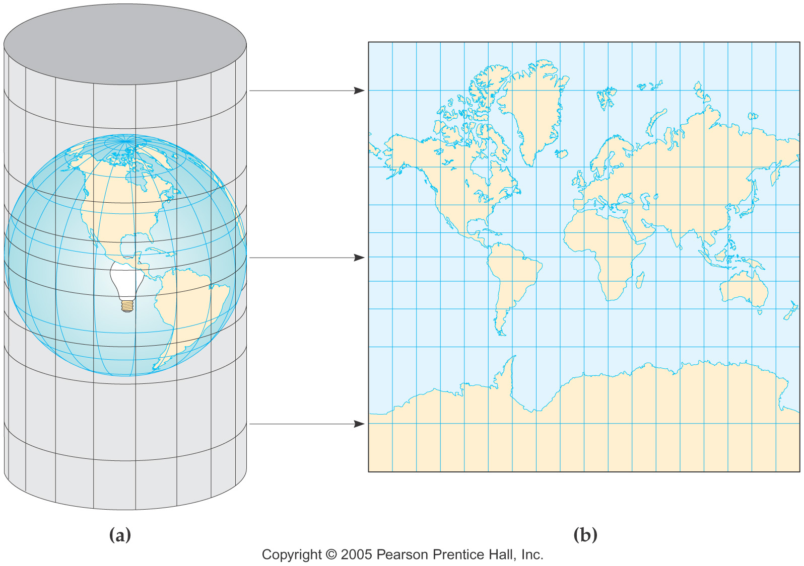
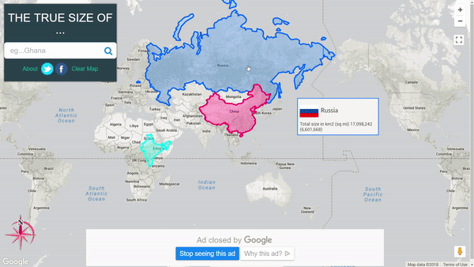
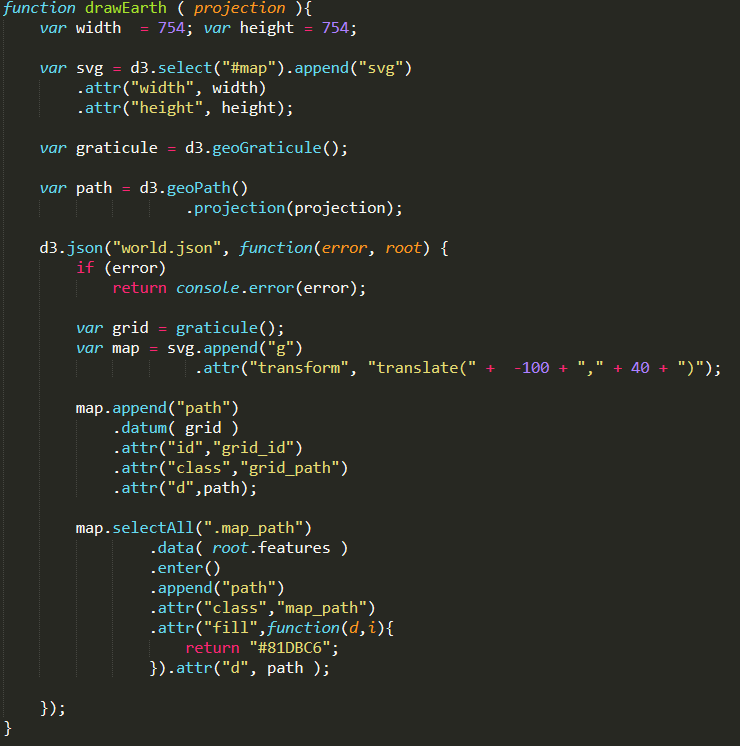
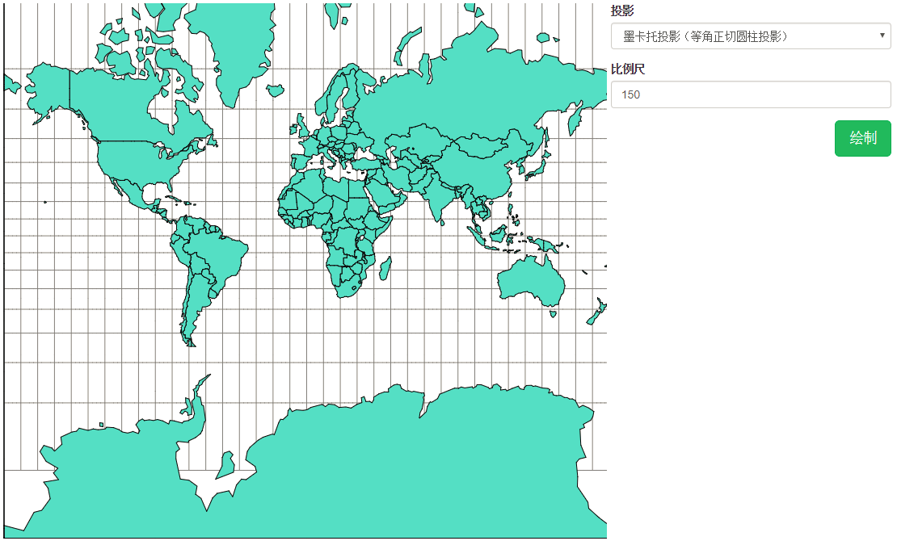

# 从最强大脑开始
每到农历年末，相信很多小伙伴和本作者一样，都忍不住会去看江苏卫视的一档脑力比拼节目《最强大脑》，尽管上一季最强大脑喷点确实很多，但依旧没有减弱"追剧"的热情。今年最强大脑（第5季）的赛制有很大的变化，挑战的人数从百人大战，到最强30脑，再到现从第三场的一对一PK，确实与以往有了很大的不同。此外，今年更加强调了选手在生活中的光环，例如本文要引用的一场比赛就是最近一期来自清华的孙勇与北京的陈泽坤的一场以地图投影为背景的比赛，孙勇就是顶着2016安徽省高考理科状元的光环来的。今年没了叨叨魏，节目的流程显得自然了很多。好了，不扯了，来、来、来来来！我们开始说本文要讲的主题--地图。


# 地图投影
在我们古代文明中，认为我们的生活空间呈现一种天圆地方的形态，地球是一个平面，后来随着文明的发展，开始有了地圆说的理论，但还是不被大多人接受。直到文艺复兴时期，葡萄牙人麦哲伦的船队完成了人类历史上第一次环球航行，它以无可辩驳的事实向全人类证明了"地球是圆的"。实际上，我们的地球是一个略扁的椭球体，地球的面积相对于人类的活动能力来说，确实非常庞大，也比较抽象。但人类很聪明，懂得用易于掌握的东西来标记或表示未知或抽象的东西，因此地图也就被发明了出来，实际上地图就是地理位置的一种抽象，便于人类更直观的理解地域的地理形态。据考古学家的推测，地图的发明比文字的发明还要早，并随着文明与观测技术的发展，地图的准确性也越来越高。到了今天，互联网与地图的结合，人们已经可以准确的描述自己的方位（经纬度），规划自己的出行路线等等，非常的便捷。而我们生活中大多见到的地图都是2D平面的，而地球是一个类似球体的立体，将一个空间到2D平面，当然不是像剥橘子皮那么简单，这里需要用到一个专业名称：地图投影（Projection）。所谓投影，最强大脑解释的也非常通俗，就是选择一个点作为光源点，在选择一个面作为投影面，光源透过地球表面映射到投影面上的图形就是地图投影。而我们最常见的平面地图就采用了墨卡托投影：

作者年少时期也痴迷于看地图，每当看到地图上的俄罗斯，直观上感觉要比中国大好几倍，但实际上俄罗斯的国土面积1709万平方公里，中国的国土面积是960万平公里，从数据来看，两个相差的面积并没有那么大的悬殊，这是怎么回事？直到工作后接触到地图开发相关项目时，才恍然大悟，是地图投影造成的。例如上图中的墨卡托投影（等角正切圆柱投影），其特点是大陆形状保持不变，但国家的面积变了。赤道变形最小，两极变形较大。因此，俄罗斯在墨卡托投影的地图上，占据了高纬度的优势，面积变大了很多，看起来比中国大很多。关于国家面积的地图表现，有一个有意思的网站 https://thetruesize.com ，可以将国家的版块拖动到任意纬度，来查看该纬度下版块投影在地图上的表现。现在，我们公平起见，将俄罗斯拉回到大致与中国相同的维度来做比较：


多年的疑惑终于解决了，这一切都是投影搞得鬼！由于地图在实际使用时，受应用场景、地理位置、地图绘制比例等因的影响，因此地理学家发明了很多投影方式。而前文我们已经介绍的墨卡托投影就是最常用的一种投影方式，由于该投影具有简单分块，保持形状不变的特点，百度地图和谷歌地图都使用了墨卡托投影。

# D3与地图
随着近几年数据可视化热潮在互联网行业的席卷，相信很多接触过前端的同学，都应该知道一个响彻宇宙的项目 --D3。D3 的全称是（Data-Driven Documents），顾名思义数据驱动文档，其实就是一个专门做数据可视化的javascript库，D3最大的特点是不依赖于Jquery，也可能是jquery的选择器不适合于需要大量绘制DOM的场景（亦或是D3的作者自负^v^），自己实现了DOM的选择器。该项目的功能还是很庞大的，作者也不准备在本文将如何使用D3，所以就不详细讲解D3的使用细节了。使用D3，在web上绘制一个世界地图，是分分钟的事情，实现代码如下：


在浏览器中运行效果如下：


简要说一下使用D3绘制地图的逻辑与原理：
1.地图的绘制原理实际上就是在 SVG 区域中使用 path 标签来定义路径，下面的例子就是使用<Path>标签定义了一条路径，它开始于位置 250 150，到达位置 150 350，然后从那里开始到 350 350，最后在 250 150 关闭路径，相当于画了一个封闭区域。
```
<svg width="100%" height="100%" version="1.1"
xmlns="http://www.w3.org/2000/svg">
	<path d="M250 150 L150 350 L350 350 Z" />
</svg>
```
如果将 <path> 标签的路径设置为地图中国家边界的路径，就实现了地图的绘制，D3 geo API对于地图的绘制，实际上就是对于 <path> 的封装。

2.那么问题来了，地图的路径值那么复杂，如何获取？实际上D3绘制地图使用GeoJson文件，是一种国家边界经纬度数据记录文件。读者可以到 d3中文站 找一些现成的，也可以到 geojson.io 去制作。

3.有了GeoJson文件，还不能直接绘制地图 ，因为GeoJSON 文件中的地图数据都是经度和纬度的信息。它们都是三维的，而要在网页上显示的是二维的，所以要用到我们前文讲的地图投影了，需要设定一个投影函数来转换经度纬度，如采用墨卡托投影d3.geoMercator()。

4.代码中d3.json()函数实现的就是通过解析world.json文件中的经纬度信息，然后通过投影函数计算出地理边界在对应的 <path> 路径值，在SVG中绘制，就实现了矢量地图的绘制。

D3，数据驱动文档，这名字不是吹的，通过一个json文件，不到20行代码，就实现了世界地图的绘制，牛X！


# 写在最后
满纸荒唐言，一把辛酸泪。
都云作者痴，谁解其中味。